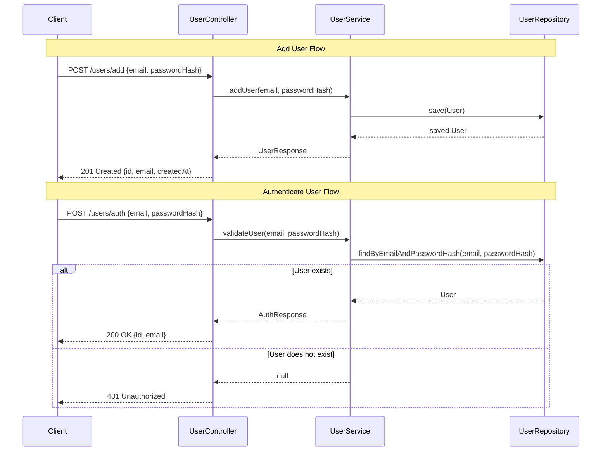

# User Service DEV API Documentation

## Overview

This DEV-only microservice API provides endpoints to **create users** and **validate credentials**. It is intended for testing and development purposes only and **should not be used in production**.

All communication is via **RESTful HTTP endpoints**.

---

## Base URL
```
http://localhost:5001
```

---

## Endpoints

### 1. Authenticate User
```http
POST /users/auth
```

**Description:**
Validates if a user exists in the database with the provided credentials.

**Request Body:**
```json
{
  "email": "user@example.com",
  "passwordHash": "hashed_password"
}
```

**Success Response:**
- Status: `200 OK`
- Body:
```json
{
  "id": 1,
  "email": "user@example.com"
}
```

**Error Response:**
- Status: `401 Unauthorized`
- Body:
```json
"Invalid credentials"
```

**Example Call (Python):**
```python
import requests

payload = {"email": "user@example.com", "passwordHash": "hashed_password"}
response = requests.post("http://localhost:5001/users/auth", json=payload)
print(response.status_code, response.json())
```

**Example Call (curl):**
```bash
curl -X POST http://localhost:5001/users/auth \
  -H "Content-Type: application/json" \
  -d '{"email":"user@example.com","passwordHash":"hashed_password"}'
```

---

### 2. Add User
```http
POST /users/add
```

**Description:**
Adds a new user to the database.

**Request Body:**
```json
{
  "email": "newuser@example.com",
  "passwordHash": "hashed_password"
}
```

**Success Response:**
- Status: `201 Created`
- Body:
```json
{
  "id": 2,
  "email": "newuser@example.com",
  "createdAt": "2025-11-17T08:00:00Z"
}
```

**Error Response:**
- Status: `400 Bad Request`
- Body: Empty (if user could not be saved)

**Example Call (Python):**
```python
import requests

payload = {"email": "newuser@example.com", "passwordHash": "hashed_password"}
response = requests.post("http://localhost:5001/users/add", json=payload)
print(response.status_code, response.json())
```

**Example Call (curl):**
```bash
curl -X POST http://localhost:5001/users/add \
  -H "Content-Type: application/json" \
  -d '{"email":"newuser@example.com","passwordHash":"hashed_password"}'
```

---

## Data Models

### User Request
```json
{
  "email": "string",
  "passwordHash": "string"
}
```

### User Response
```json
{
  "id": 1,
  "email": "user@example.com",
  "createdAt": "2025-11-17T08:00:00Z"
}
```

### Auth Response
```json
{
  "id": 1,
  "email": "user@example.com"
}
```

---

## Notes
- Passwords are **never returned** in any response.
- These endpoints are **DEV ONLY**.
- Ensure proper error handling for failed validations.
- `createdAt` is automatically set by the server.

---

## UML Sequence Diagram
This sequence diagram shows the interactions for adding and authenticating a user.



